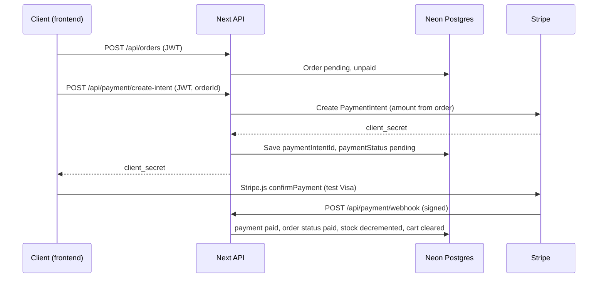

# Streetwear Fullstack App (Next.js + Neon Postgres + Stripe)

Production-style fullstack app on a single Next.js deployment:
- UI pages (static HTML from `public/ui` mapped to friendly routes)
- REST API under `/api/*` with JWT auth and Stripe (test mode) for Visa/card payments.

## Folder structure

```text
backend/
├── controllers/       # Business logic (auth, products, cart, orders, payment)
├── lib/               # DB + Stripe clients
├── middleware/        # auth, CORS, validation helper
├── prisma/            # Prisma schema / migrations
├── pages/
│   ├── api/           # REST endpoints
│   ├── _app.js
│   └── index.js
├── scripts/
│   └── seedProducts.js
├── utils/             # ApiError, catchAsync, raw body helper
├── .env.example
├── next.config.js
├── package.json
└── README.md
```

## Quick start (local)

1. Install [Node.js LTS](https://nodejs.org/) (includes `npm`).
2. `cd backend`
3. `cp .env.example .env` and fill values (see below).
4. `npm install`
5. `npm run prisma:generate`
6. `npm run prisma:migrate -- --name init`
7. `npm run dev` → UI + API at `http://localhost:3000`

Smoke checks:
- UI: `GET /`, `GET /products`, `GET /cart`, `GET /checkout`
- API: `GET /api/health`

## Environment variables

| Variable | Purpose |
|----------|---------|
| `DATABASE_URL` | Neon PostgreSQL connection string |
| `POSTGRES_URL` | Neon pooled URL |
| `POSTGRES_URL_NON_POOLING` | Neon non-pooling URL |
| `POSTGRES_USER` / `POSTGRES_PASSWORD` / `POSTGRES_HOST` / `POSTGRES_DATABASE` | Neon DB credentials |
| `PGHOST` / `PGHOST_UNPOOLED` / `PGUSER` / `PGDATABASE` / `PGPASSWORD` | PG-compatible envs |
| `NEON_PROJECT_ID` | Neon project id |
| `JWT_SECRET` | Strong secret for signing JWTs |
| `JWT_EXPIRES_IN` | Optional, default `7d` |
| `STRIPE_SECRET_KEY` | Stripe **secret** key (`sk_test_...`) |
| `STRIPE_WEBHOOK_SECRET` | Webhook signing secret (`whsec_...`) |
| `NEXT_PUBLIC_BASE_URL` | Public URL of this API (e.g. `http://localhost:3000`) — use in frontend Stripe config |
| `FRONTEND_URL` | Your storefront origin for CORS + payment redirects (e.g. `http://localhost:5173`) |

Copy from `.env.example` and adjust.

## API endpoints

**Auth (public)**

| Method | Path | Body | Description |
|--------|------|------|---------------|
| `POST` | `/api/auth/register` | `{ name, email, password }` | Register, returns JWT |
| `POST` | `/api/auth/login` | `{ email, password }` | Login, returns JWT |

**Products**

| Method | Path | Auth | Description |
|--------|------|------|-------------|
| `GET` | `/api/products` | No | List with **pagination** + **search** + **filters** |
| `GET` | `/api/products/[id]` | No | Get one |
| `POST` | `/api/products` | JWT | Create |
| `PUT` / `PATCH` | `/api/products/[id]` | JWT | Update |
| `DELETE` | `/api/products/[id]` | JWT | Delete |

**Query params for `GET /api/products`**

- `page` (default `1`)
- `limit` (default `12`, max `100`)
- `search` — case-insensitive match on `name`
- `category` — exact match
- `minPrice`, `maxPrice` — numeric range on `price`

**Cart (JWT)**

| Method | Path | Body / query | Description |
|--------|------|--------------|-------------|
| `GET` | `/api/cart` | — | Current cart (populated products) |
| `POST` | `/api/cart` | `{ productId, quantity? }` | Add / merge quantity |
| `PATCH` | `/api/cart/item?productId=` | `{ quantity }` | Update line quantity |
| `DELETE` | `/api/cart/item?productId=` | — | Remove line |

**Orders (JWT)**

| Method | Path | Body | Description |
|--------|------|------|-------------|
| `POST` | `/api/orders` | `{ shippingFee? }` | Create from cart (validates stock) |
| `GET` | `/api/orders` | — | Order history (paginated: `page`, `limit`) |
| `GET` | `/api/orders/[id]` | — | Single order (owner only) |
| `PATCH` | `/api/orders/[id]` | `{ status: "pending"\|"paid"\|"shipped" }` | Update fulfillment status |

**Payment**

| Method | Path | Auth | Description |
|--------|------|------|-------------|
| `POST` | `/api/payment/create-intent` | JWT | `{ orderId }` → Stripe `clientSecret` |
| `GET` | `/api/payment/success` | No | Redirect to frontend success (optional return URL target) |
| `GET` | `/api/payment/cancel` | No | Redirect to frontend cancel |
| `POST` | `/api/payment/webhook` | Stripe signature | Updates DB after payment events |

**Auth header:** `Authorization: Bearer <token>`

## Payment flow (Stripe test mode)

Visa and other brands are exercised through Stripe’s test cards; the API uses **PaymentIntents** (not Checkout), which matches a custom storefront.



**Frontend hints**

- After `create-intent`, use **Stripe.js** with the returned `clientSecret`.
- Pass `return_url` / handling as needed; you can point `return_url` at `GET https://<api>/api/payment/success` so the API redirects to `FRONTEND_URL/checkout/success`.

## Neon database

1. Create a Neon project at [neon.tech](https://neon.tech).
2. Create database/user and copy `DATABASE_URL`.
3. Add `DATABASE_URL` + `POSTGRES_*` / `PG*` env vars to local `.env` and Vercel.
4. Redeploy after env updates.

## Seed 2000–3000 products

```bash
# default 2500 products (warn: deletes all products in the collection)
npm run seed

# or
SEED_COUNT=3000 node scripts/seedProducts.js
```

For product catalog scale (2k–3k SKUs), ensure indexes exist on product `name`, `category`, and `(category, price)` in your Neon/Postgres schema.

## Stripe setup (test mode)

1. Create a [Stripe](https://stripe.com) account.
2. Turn on **Test mode** (toggle in Dashboard).
3. **Developers → API keys** → copy **Secret key** (`sk_test_...`) → `STRIPE_SECRET_KEY`.
4. **Test Visa (success):** card `4242 4242 4242 4242`, any future expiry, any CVC, any ZIP (see [Stripe test cards](https://docs.stripe.com/testing)).
5. **Webhooks**
   - **Local:** install [Stripe CLI](https://stripe.com/docs/stripe-cli), run:
     - `stripe login`
     - `stripe listen --forward-to localhost:3000/api/payment/webhook`
     - Copy the printed **`whsec_...`** → `STRIPE_WEBHOOK_SECRET` in `.env`.
   - **Vercel:** Dashboard → Developers → Webhooks → Add endpoint → URL `https://<your-project>.vercel.app/api/payment/webhook` → select events `payment_intent.succeeded`, `payment_intent.payment_failed` → reveal signing secret → set in Vercel env as `STRIPE_WEBHOOK_SECRET`.

## Deploy on Vercel (step-by-step)

1. Push `backend/` (or whole repo) to GitHub/GitLab/Bitbucket.
2. [Vercel](https://vercel.com) → **New Project** → import the repo.
3. Set **Root Directory** to `backend` (if the repo contains other folders).
4. Framework: **Next.js** (auto-detected).
5. **Environment Variables** — add all variables from `.env.example` (production values):
   - `DATABASE_URL`, `JWT_SECRET`, `STRIPE_SECRET_KEY`, `STRIPE_WEBHOOK_SECRET`
   - `FRONTEND_URL` = your deployed frontend URL (e.g. `https://shop.example.com`)
   - `NEXT_PUBLIC_BASE_URL` = your Vercel API URL (e.g. `https://your-api.vercel.app`)
6. **Deploy**.
7. Update Stripe webhook endpoint to the **production** URL `/api/payment/webhook` and use the **production** webhook secret if you use live mode later.

**CORS:** `middleware/cors.js` uses `FRONTEND_URL` as `origin` (with credentials). For multiple origins, extend that middleware (array or allowlist).

**API routes:** All handlers live under `pages/api/**`; no extra Vercel config is required.

## Security & performance (summary)

- Passwords hashed with **bcrypt** (cost factor 12).
- **Zod** validation on inputs; errors return `400` with messages.
- **JWT** on cart, orders, payment intent, and product mutations.
- **Global error wrapper** via `catchAsync` on routes.
- Database indexes for product listing at 2k–3k SKUs; pagination caps (`limit` max 100 for products, 50 for orders).
- Stripe webhook verifies **signature** using the **raw** body (`bodyParser: false` on `pages/api/payment/webhook.js`).

## Troubleshooting

- **Webhook 400 / signature invalid:** Ensure nothing parses the body before Stripe’s verifier; keep `bodyParser: false` on the webhook route and use the correct `STRIPE_WEBHOOK_SECRET` for that endpoint (CLI secret vs Dashboard secret differ).
- **CORS errors:** Set `FRONTEND_URL` exactly to the browser origin (scheme + host + port).
- **Database timeout:** Verify Neon connection string, SSL mode, and Vercel env values.

## License

Use freely for your streetwear project.
